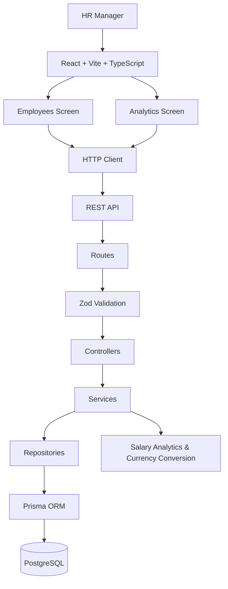
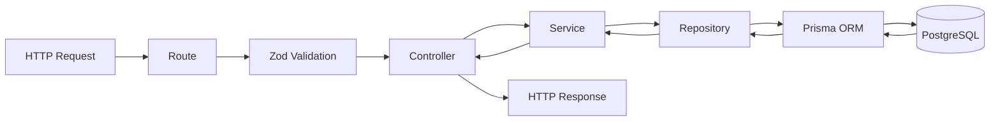
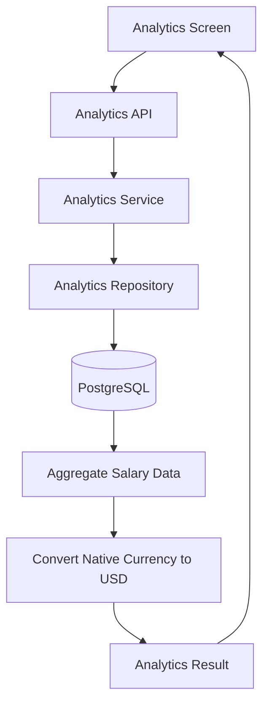

# System Architecture

## 1. Overview

The ACME Employee Salary Management application follows a layered architecture with a React frontend and a Node.js backend.

The frontend is responsible for presentation, user interaction, state management, and binding API responses to UI components. Business logic, salary analytics, currency conversion, validation rules, and data access are handled by the backend.

## 2. Technology Stack

| Layer | Technology |
|---|---|
| Frontend | React, Vite, TypeScript |
| Backend | Node.js, Express, TypeScript |
| API | REST |
| Validation | Zod |
| ORM | Prisma |
| Database | PostgreSQL |
| Testing | Unit and integration tests |
| CI/CD | GitHub Actions |

## 3. High-Level Architecture



## 4. Frontend Architecture

The frontend follows a component-based architecture.

```text
frontend/
├── src/
│   ├── assets/
│   │
│   ├── components/
│   │   └── common/
│   │       ├── Header/
│   │       ├── Modal/
│   │       ├── ConfirmationModal/
│   │       └── Pagination/
│   │
│   ├── pages/
│   │   ├── Employees/
│   │   │   └── Employees.tsx
│   │   │
│   │   └── Analytics/
│   │       └── Analytics.tsx
│   │
│   ├── services/
│   │   ├── employee.service.ts
│   │   └── analytics.service.ts
│   │
│   ├── client/
│   │   └── client.ts
│   │
│   ├── types/
│   ├── hooks/
│   ├── utils/
│   │
│   ├── App.tsx
│   └── main.tsx
│
└── package.json
```

### Frontend responsibilities

- Render application screens and reusable components.
- Handle user interactions.
- Manage UI state.
- Call backend APIs through the shared HTTP client.
- Bind API responses to UI components.
- Perform presentation-level formatting only.

The frontend should not be responsible for business calculations or data derivations.

For example, salary totals, averages, medians, salary bands, and currency conversions are calculated by the backend.

## 5. Backend Architecture

The backend follows a layered architecture.

```text
backend/
├── src/
│   ├── routes/
│   │   ├── employee.routes.ts
│   │   └── analytics.routes.ts
│   │
│   ├── controllers/
│   │   ├── employee.controller.ts
│   │   └── analytics.controller.ts
│   │
│   ├── services/
│   │   ├── employee.service.ts
│   │   └── analytics.service.ts
│   │
│   ├── repositories/
│   │   ├── employee.repository.ts
│   │   └── analytics.repository.ts
│   │
│   ├── middleware/
│   │   ├── validation.ts
│   │   └── error-handler.ts
│   │
│   ├── database/
│   │   └── client.ts
│   │
│   ├── config/
│   │   └── env.ts
│   │
│   ├── types/
│   │
│   ├── app.ts
│   └── server.ts
│
├── prisma/
│   ├── schema.prisma
│   └── seed.ts
│
├── tests/
└── package.json
```

## 6. Backend Request Flow



### Layer responsibilities

| Layer | Responsibility |
|---|---|
| Routes | Define REST API endpoints |
| Validation | Validate request input using Zod |
| Controllers | Handle HTTP requests and responses |
| Services | Contain business logic |
| Repositories | Handle database operations |
| Prisma | Provide type-safe database access |
| PostgreSQL | Persist application data |

## 7. Analytics Flow

Salary analytics are calculated on the backend rather than in the frontend.



The analytics screen provides:

- Total payroll
- Average salary
- Median salary
- Employee count
- Salary by country
- Salary by department
- Salary bands

Interactive filters include:

- Country
- Department
- Employee status

## 8. Performance Considerations

The application is designed to support the seeded dataset of 10,000 employees without unnecessary complexity.

- Employee listing uses server-side pagination.
- Filtering is performed by the backend/database.
- Frequently filtered fields are indexed.
- Analytics calculations are performed by the database/backend.
- Only aggregated analytics results are returned to the frontend.
- The complete employee dataset is not loaded into the browser.
- No custom data structures or unnecessary caching infrastructure are introduced for the MVP.

## 9. Architectural Decisions

### Business Logic

Business rules and calculations are kept in the backend to maintain a single source of truth.

### Currency

Employee salaries are stored in their native currency. Analytics normalize salaries to USD using the seeded exchange-rate table.

### Authentication

Authentication is intentionally out of scope for this assessment. The application assumes an already-authenticated HR Manager. Authentication/SSO can be introduced as a future production consideration.

### Salary History

Only the employee's current base salary is maintained. Salary revision history is out of scope for the MVP.

### Employee Deactivation

Employees are not physically deleted. The employee status is changed to `INACTIVE` so organizational analytics remain accurate.

### Error Logging

A persistent error-log table is not included in the MVP. Unexpected application errors are handled through centralized error handling and application logging.