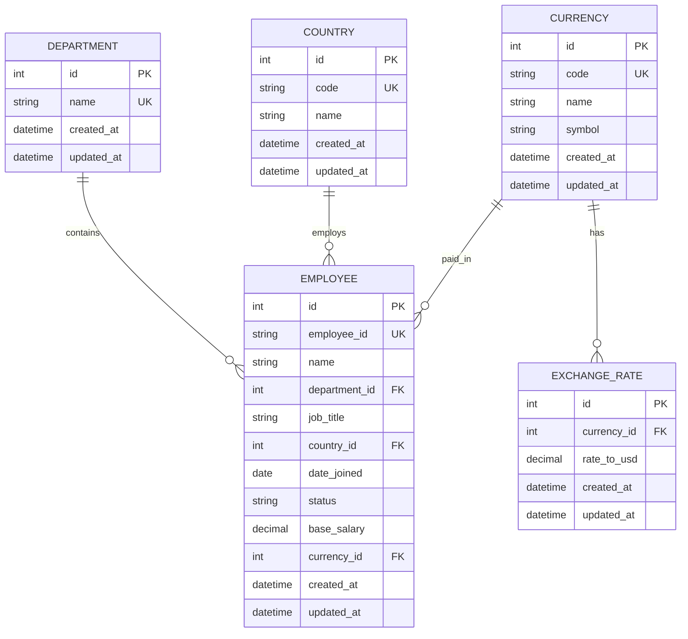

# Entity Relationship Diagram

## Database Entities

The application uses five core entities:

- Employee
- Department
- Country
- Currency
- ExchangeRate

## ER Diagram



## Relationships

### Department → Employee

**One-to-Many**

A department can contain multiple employees, while each employee belongs to one department.

```text
Department (1) ─────────── (N) Employee
```

### Country → Employee

**One-to-Many**

A country can have multiple employees, while each employee belongs to one country.

```text
Country (1) ─────────── (N) Employee
```

### Currency → Employee

**One-to-Many**

A currency can be associated with multiple employees, while each employee has one salary currency.

```text
Currency (1) ─────────── (N) Employee
```

### Currency → ExchangeRate

**One-to-Many**

A currency can have exchange-rate records. For the MVP, one current seeded rate will be maintained for each supported currency.

```text
Currency (1) ─────────── (N) ExchangeRate
```

## Salary and Currency Model

Employee salaries are stored in their native currency.

For example:

```text
Employee
---------
base_salary = 1,500,000
currency = INR
```

The backend retrieves the corresponding exchange rate:

```text
INR → 0.012 USD
```

and calculates:

```text
1,500,000 × 0.012 = 18,000 USD
```

The converted USD value is calculated when required for analytics and is not stored on the employee record.

## Constraints and Indexes

### Employee

- `id` is the primary key.
- `employee_id` is unique.
- `department_id` is a foreign key.
- `country_id` is a foreign key.
- `currency_id` is a foreign key.
- `base_salary` must be greater than zero.
- `status` is either `ACTIVE` or `INACTIVE`.

Indexes:

- `employee_id` — unique index
- `department_id` — index
- `country_id` — index
- `currency_id` — index
- `status` — index

### Department

- `id` is the primary key.
- `name` is unique.

### Country

- `id` is the primary key.
- `code` is unique.

### Currency

- `id` is the primary key.
- `code` is unique.

### ExchangeRate

- `id` is the primary key.
- `currency_id` is a foreign key.
- `rate_to_usd` represents the seeded conversion rate from the currency to USD.

## Deliberately Excluded Entities

The following are intentionally not modeled for the MVP:

- SalaryHistory
- Bonus
- Equity
- Allowance
- Authentication/User
- ErrorLog
- Historical exchange-rate tracking

These can be introduced later if the product requirements expand.